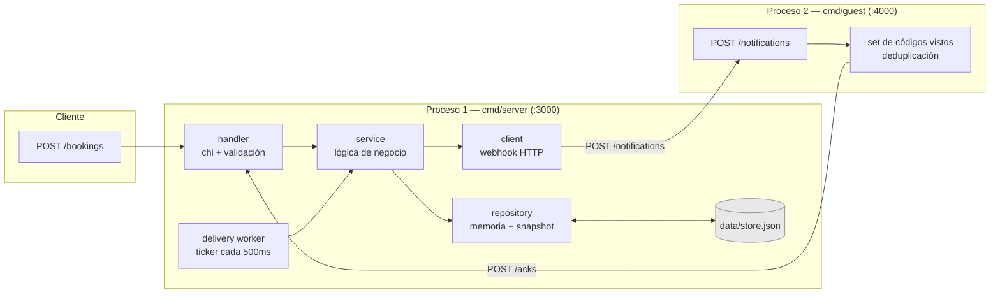
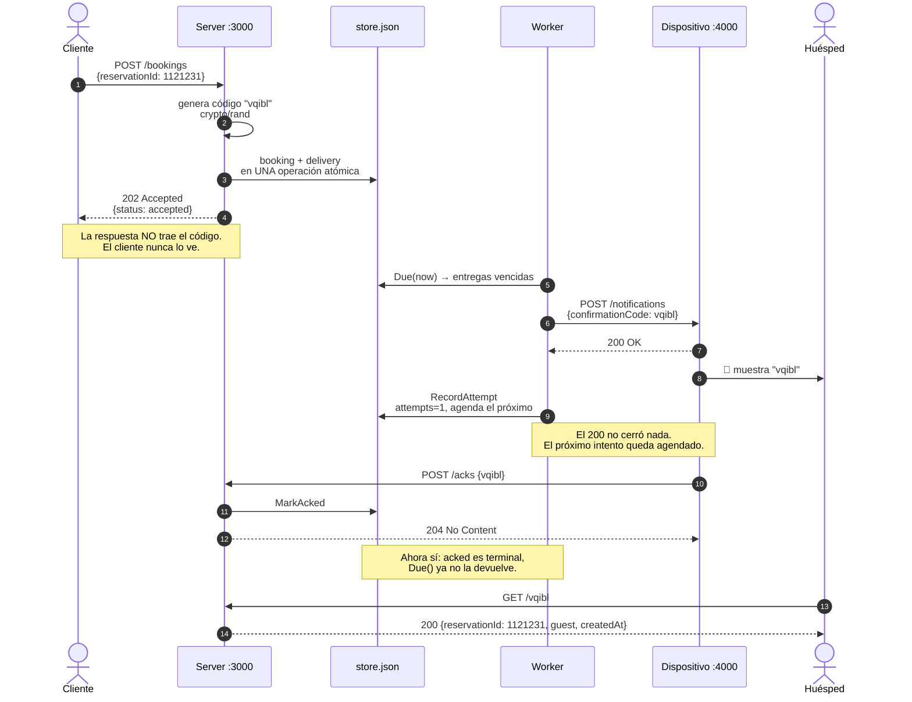
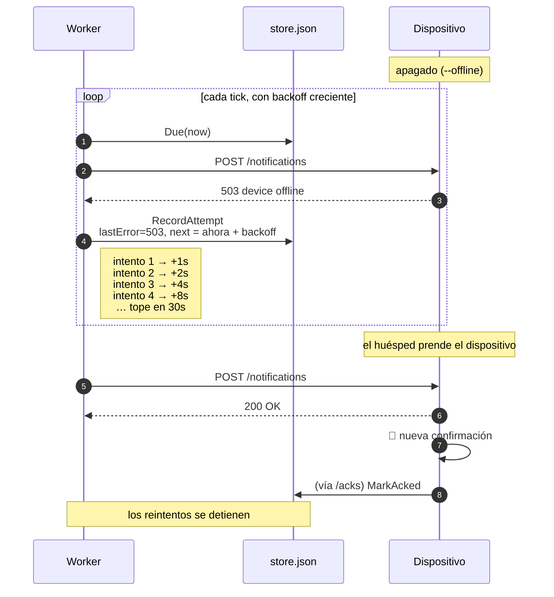
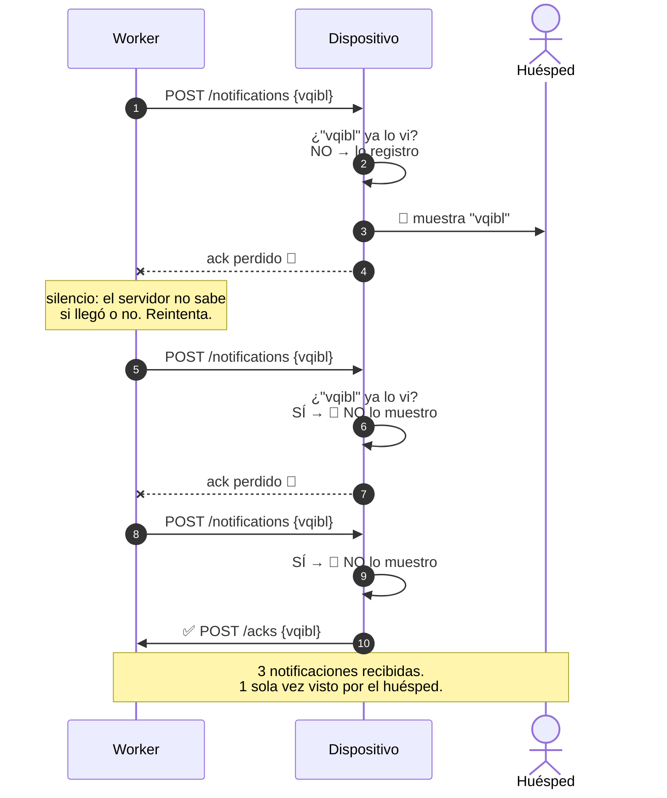
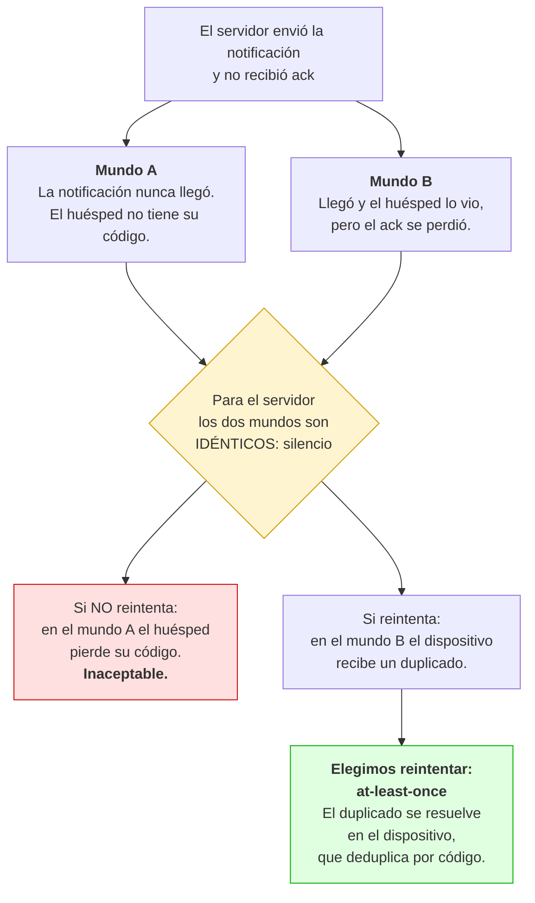
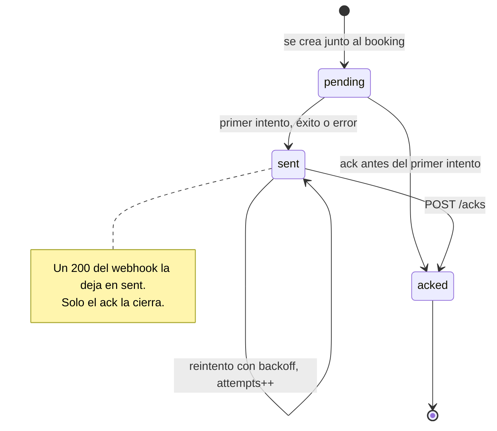
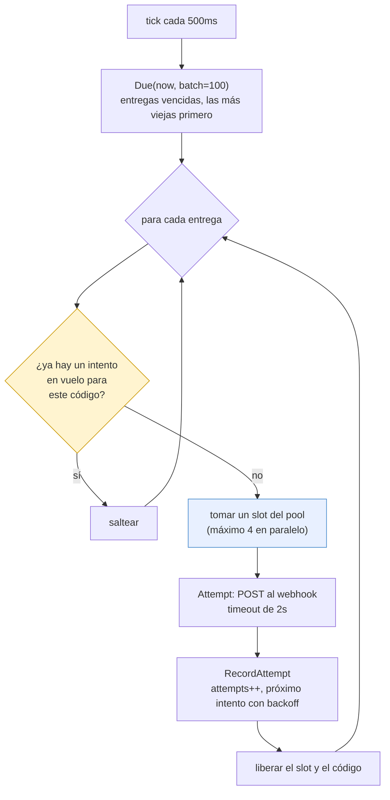
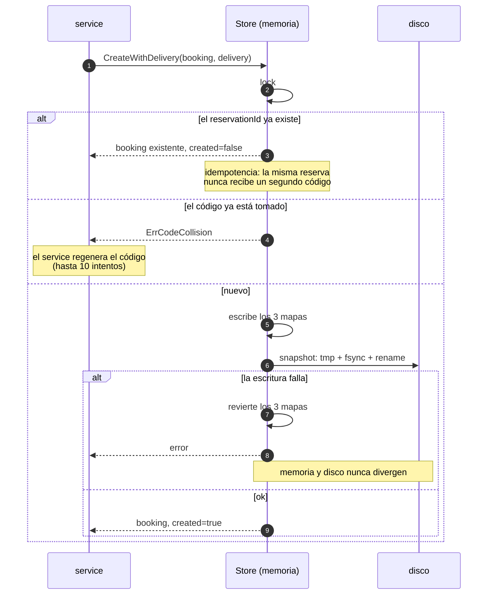
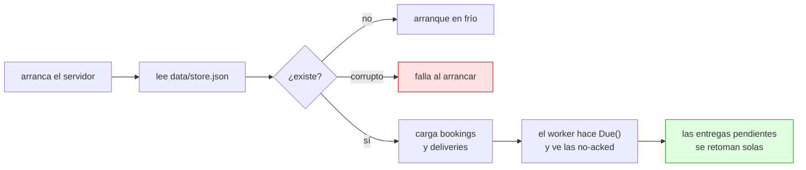
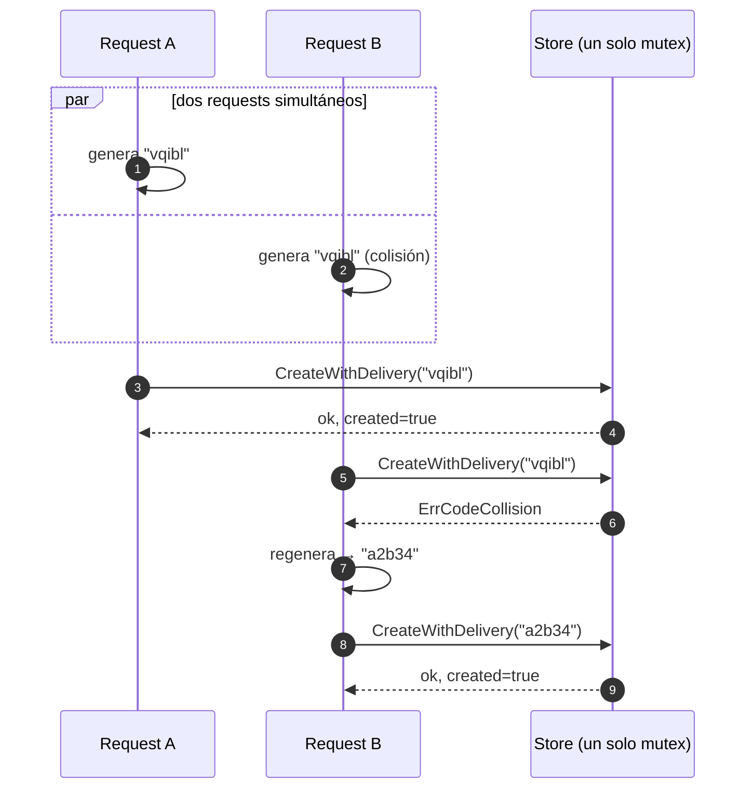

# Cómo funciona el servicio

Diagramas del Booking Confirmation Service. Los ejemplos usan datos de una
corrida real: reserva `1121231`, código `vqibl`.

---

## 1. Los dos procesos

Son dos binarios separados a propósito: el dispositivo del huésped **no** es
parte del servidor, y eso es lo que permite que esté offline.



El código **nunca** vuelve por donde entró: sale por el webhook.

---

## 2. Camino feliz



---

## 3. El dispositivo está apagado

Lo que probás con `make run-guest GUEST_FLAGS="--offline"`.



**Sin máximo de intentos**: la consigna pide reintentar hasta entregar. El tope
de 30 segundos evita bombardear al dispositivo, y el jitter de ±20% evita que
muchas entregas vencidas salgan todas juntas.

---

## 4. El ack se pierde — la garantía central

Lo que probás con `--ack-loss-rate=0.8`. **Este es el diagrama que conviene
mostrar en la entrevista.**



El dispositivo **re-ackea los duplicados**, y eso es lo que corta el loop: si el
servidor reenvió, es porque el ack anterior no le llegó.

Verificable con `GET :4000/confirmations`:

```json
{ "confirmationCode": "vqibl", "notifications": 3, "displays": 1 }
```

---

## 5. Por qué exactly-once no se puede

El argumento que justifica todo el diseño.



Por eso **"nunca dos veces" significa que el huésped nunca lo *ve* dos veces**,
no que el dispositivo nunca lo *reciba* dos veces. Es la única interpretación
implementable, y es la que usan las colas reales con sus claves de idempotencia.

---

## 6. Estados de una entrega



Dos cosas que no se ven en el dibujo pero importan:

- **`acked` es terminal.** `RecordAttempt` sobre una entrega ya ackeada es un
  no-op, así que un intento que estaba en vuelo cuando llegó el ack no la reabre.
- **`Due()`** devuelve las que **no** están en `acked` y cuyo `nextAttemptAt`
  ya pasó. Por eso el ack detiene los reintentos sin que nadie cancele nada.

---

## 7. Un tick del worker



Dos protecciones concretas: el **pool de 4** evita que un dispositivo lento
frene al resto, y la marca de **en vuelo** evita que dos ticks tomen la misma
entrega (un intento puede durar más que un tick).

---

## 8. Transactional outbox y reinicio

El booking y su entrega se guardan juntos o no se guardan.



Y al reiniciar:



Falla al arrancar con un snapshot corrupto **a propósito**: arrancar en frío
perdería entregas pendientes en silencio.

---

## 9. Unicidad del código bajo concurrencia



El check y el insert ocurren **bajo el mismo lock**, así que no hay ventana
entre "¿existe?" y "lo guardo". Sin eso, dos requests concurrentes podrían
llevarse el mismo código.

---

## Cómo se relaciona con el código

| Diagrama | Archivo |
|---|---|
| 1. Procesos y capas | `cmd/server/main.go`, `cmd/guest/main.go` |
| 2. Camino feliz | `internal/handler/booking_handler.go`, `internal/worker/delivery_worker.go` |
| 3. Reintentos | `internal/service/delivery_service.go` (`NextAttemptAt`) |
| 4. Dedupe | `cmd/guest/main.go` (`record`) |
| 6. Estados | `internal/model/delivery.go` |
| 7. Tick | `internal/worker/delivery_worker.go` (`tick`) |
| 8. Outbox | `internal/repository/store.go` (`CreateWithDelivery`) |
| 9. Unicidad | `internal/service/booking_service.go` (`Create`) |
